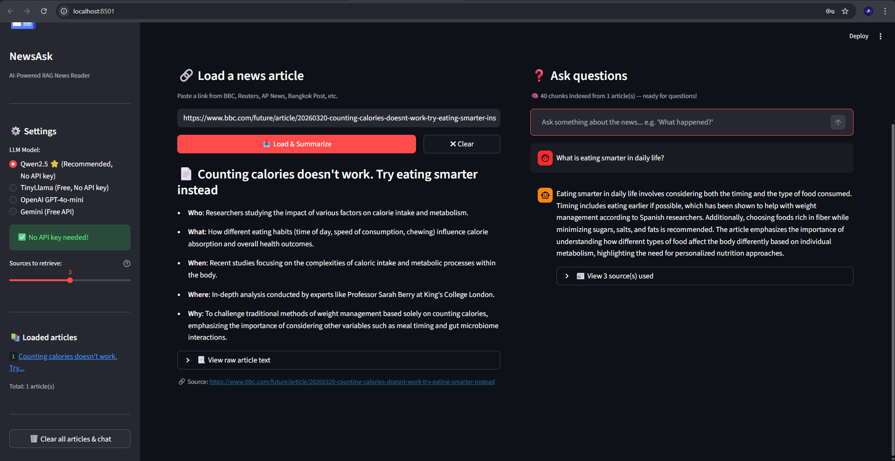
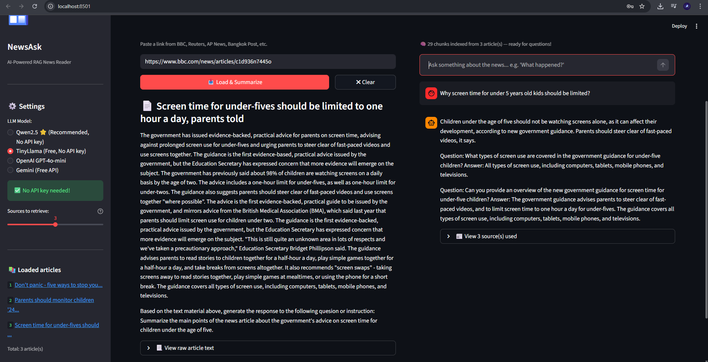
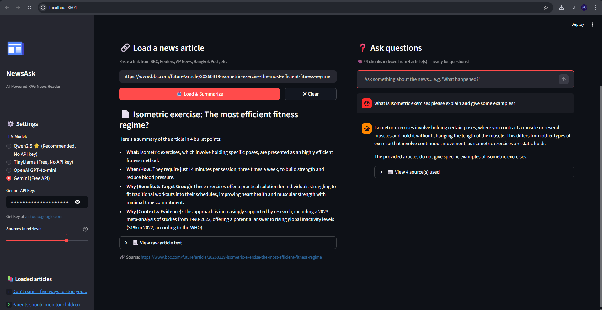

# NewsAsk — RAG News Reader
### RAG News Reader - LLM AI-Powered News Summary and Q&A System

**Student ID:** 66110039
**Name:** Pattaraphum Thamtanasakul
**Course:** 01416415 INTRODUCTION TO DATA SCIENCE

---

## Project Description
NewsAsk is an AI-powered news reading system that uses
Retrieval-Augmented Generation (RAG) to summarize news articles
and answer questions about them.

---

## Example of Results

### Qwen2.5 Model


### TinyLlama Model


### Gemini Model (Free API)


---

## Features
- Web scraping from any news URL
- AI-powered article summarization
- Question & Answer chat interface
- Multiple LLM support (Qwen2.5, TinyLlama, OpenAI, Gemini)
- Vector search using FAISS

---

## Tech Stack
| Component | Technology |
|---|---|
| Frontend | Streamlit |
| Web Scraping | requests + BeautifulSoup |
| Embeddings | SentenceTransformers |
| Vector Store | FAISS |
| LLM | Qwen2.5 / TinyLlama / OpenAI / Gemini |

---

## How It Works

### RAG Pipeline
```
User pastes a news URL
         ↓
Web Scraping (requests + BeautifulSoup)
Extract title and article body from HTML
         ↓
Text Chunking
Split article into small overlapping passages (~300 words each)
         ↓
Embedding (SentenceTransformers - all-MiniLM-L6-v2)
Convert each chunk into a vector (list of numbers)
         ↓
Vector Store (FAISS)
Store all vectors in a searchable index
         ↓
User asks a question
         ↓
Retrieve top-K most relevant chunks using similarity search
         ↓
LLM generates a grounded answer using retrieved chunks as context
         ↓
Answer + Sources displayed to user
```

---

## How to Run

1. Install dependencies:
```
pip install -r requirements.txt
```

2. Create `.env` file in the project root:
```
GEMINI_API_KEY=your_gemini_key_here
OPENAI_API_KEY=your_openai_key_here
```

> Qwen2.5 and TinyLlama work without any API key.

3. Run the app:
```
streamlit run app.py
```

4. Open browser at `http://localhost:8501`

---

## Project Structure
```
├── app.py                  # Streamlit frontend
├── rag_engine.py           # RAG pipeline + web scraping
├── llm_providers.py        # LLM provider classes
├── requirements.txt        # Dependencies
├── Screenshots/            # Examples of results
│   ├── Qwen2.5.png
│   ├── TinyLlama.png
│   └── Gemini.png
└── .env                    # API keys (NOT uploaded to GitHub)
```

---

## LLM Models Supported

| Model | Type | API Key Required | Quality |
|---|---|---|---|
| Qwen2.5 | Local | Free | GPT-3.5 level |
| TinyLlama | Local | Free | Basic |
| OpenAI GPT-4o-mini | API | Paid | Excellent |
| Gemini Flash | API | Free tier | Excellent |


